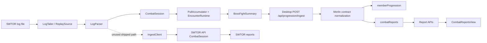

# Parse To Combat Reports Completion Plan

## Goal

Deliver a deterministic, durable, multi-tenant pipeline from a SWTOR combat-log byte to a trustworthy Merlin combat report. A completed pull must survive file rotation, disconnects, retries, process restarts, concurrent delivery, schema upgrades, and report retrieval without duplication or field loss.

This plan begins after BARAS encounter-runtime parity. Encounter identity, phases, counters, timers, shields, challenges, and expanded metrics already exist. The remaining work is primarily transport, persistence, report fidelity, and report usability.

## Definition Of Done

The flow is complete only when all of the following hold:

1. Parsing the same log produces byte-for-byte equivalent normalized pull summaries in live, replay, and server-ingest modes.
2. Every pull has a stable identity that survives retries and process restarts.
3. A completed pull is never silently lost and never stored twice.
4. File rotation and truncation cannot attribute a pull to the wrong character or file.
5. Concurrent uploads cannot overwrite or reorder existing fights.
6. Every accepted contract field is either persisted intentionally or rejected explicitly.
7. Reports are guild-scoped and enforce a documented access policy.
8. Death audits contain real combat events, not generated placeholders.
9. Report list and detail requests stay below bounded response and MongoDB document sizes.
10. Users can inspect totals, phases, abilities, challenges, mechanics, deaths, and parser quality from the report UI.
11. Failures expose an actionable state in the desktop and structured diagnostics on the server.

## PR Task Header

- Title: `feat: deterministic durable combat-report ingestion and report fidelity`
- Scope: SWTOR_Prog desktop/parser + Merlin ingestion/reporting pipeline
- Type: major release workstream
- Branch target: `feature/parse-to-combat-reports`
- Depends on: BARAS encounter-runtime parity already shipped
- Primary goals:
  - stable pull identity and idempotency across retries and reconnects;
  - durable desktop outbox and ingestion receipts;
  - lossless contract v3 and explicit guild tenancy;
  - normalized Mongo storage with atomic fight upserts and report access control;
  - real death audits and query budgets for report UIs.

## Execution Checklist

### PR 1 — contract baseline + canonical replay fixture
- Confirm a checked-in golden corpus with file hash, metric checksum, unknown counts, pull identities, and outcomes.
- Add a maximal round-trip fixture for the progression contract and preserve payload shape during validation.
- Measure size budgets for 8-player, 16-player, long-duration, and mechanics-heavy fights.
- Mark every field as `persist`, `derive`, `live-only`, `diagnostic-only`, or `deprecated`.
- Exit criteria: three real logs produce stable summaries and the contract round trip is lossless.

### PR 2 — stable identity + v3 contract
- Add deterministic `eventId` / `logFileId` and preserve `logFileName` through normalization.
- Version progression payloads as v3 while maintaining v2 compatibility.
- Return durable ingest receipts with `eventId`, `reportId`, `fightId`, `persistedAt`, `duplicate`, and `requestId`.
- Reject conflicting re-use of the same `eventId` with `409 Conflict`.
- Exit criteria: upload identity no longer depends on file date or mutable indexes.

### PR 3 — log lifecycle + event ordering
- Fix rotation and truncation sequencing so old sessions close before reset and old file identity remains attached to the correct pull.
- Add sequence high-water tracking for raw ingest duplicates, gaps, and stale sessions.
- Preserve 12-hour rollover behavior and add explicit midnight regression tests.
- Exit criteria: no rotation, truncation, or reconnect replays change event counts or metric checksums.

### PR 4 — durable desktop outbox
- Replace fire-and-forget completion callbacks with an atomic local outbox keyed by `eventId`.
- Retry transient failures with bounded exponential backoff and quarantine permanent validation failures.
- Keep live snapshots best effort and separate from durable pull delivery.
- Exit criteria: completed pulls remain recoverable through restart and network failures.

### PR 5 — report storage safety + tenancy
- Add `guildId`, `visibility`, `schemaVersion`, and stable source identity to report headers and fights.
- Normalize to report-session/fight collection layout and add the required unique indexes.
- Enforce authorization in list/detail/death/export/delete routes.
- Exit criteria: no report mutation performs array-level read/replace without atomic semantics.

### PR 6 — normalized report/fight persistence
- Upsert fights atomically by `eventId` and store report sessions separately from fight documents.
- Derive report time bounds from fight timestamps and keep roster unions keyed by stable player IDs.
- Exit criteria: report sizes remain bounded and concurrent appends preserve both fights and roster members.

### PR 7 — death audits and raw retention
- Persist or reconstruct real death audits from retained event buckets rather than generating placeholders.
- Keep raw retention distinct from summary/audit retention and label truncated data explicitly.
- Exit criteria: no production death report shows fabricated HP, healing, or damage values.

### PR 8 — report assembly + projection fidelity
- Partition by stable log/session identity rather than date-derived naming, and sort fights by timestamp using `eventId` as the stable key.
- Preserve counters, terminal evidence, challenge data, parser diagnostics, and audit completeness in projections.
- Exit criteria: replay and live reports match the canonical envelope and all expected fields survive the round trip.

### PR 9 — scalable queries and body constraints
- Split list/detail APIs and apply MongoDB projections to keep payloads bounded.
- Add request-size checking before `request.json()`, return `413` when exceeded, and use ETags/compression for immutable reports.
- Exit criteria: list/detail latency and payload size stay within the recommended budgets.

### PR 10 — report UX completion
- Replace count-only mechanics/challenge rendering with real timeline and per-player detail views.
- Expose expanded metrics and lazy load details from the split APIs.
- Exit criteria: every persisted analytics category has a user-facing inspection path.

### PR 11 — observability + diagnostics
- Add `eventId`, `sessionId`, and `requestId` traceability to logs and responses.
- Record upload/parse/persist/query timing and expose queue, conflict, and persistence diagnostics.
- Exit criteria: operators can trace a completed pull from desktop creation to final report.

### PR 12 — migration, rollback, and release
- Deploy v3 readers and compatibility shims before switching reads to normalized storage.
- Run shadow writes, monitor conflicts/duplicate metrics, and hold rollback isolation until parity is verified.
- Exit criteria: old report codes continue resolving and outbox data survives rollback safely.

## Current Repository Verification

The following items from the original gap audit are now implemented in the current worktree:

- versioned progression envelopes preserve stable event identity and log metadata;
- progression ingest validates payload size, persists reports durably, and returns conflict-safe receipts;
- normalized combat-report sessions, fights, and raw-event buckets use atomic upserts and guild-scoped authorization;
- report indexes, split list/detail routes, and factual death audits are implemented;
- Merlin no longer contains the optional companion app or its server-side ingestion paths.

The remaining work is production verification, mobile device verification, release review, and any report fidelity gaps discovered against live combat logs.

## Current Pipeline



## Historical Gap Audit

The table below records the original implementation gaps that motivated this plan. It is retained for traceability and is not a statement of the current repository state; the implementation status above is authoritative.

| Gap | Owning surface | Consequence |
| --- | --- | --- |
| `logFileName` is accepted by Zod but dropped by `normalizeProgressionEventEnvelopeContract` | `Merlin/src/lib/integration-contracts.ts` | Pulls can be keyed by date-derived filenames and unrelated sessions can merge. |
| No stable transport `eventId` exists | desktop API and Merlin contract | Retry safety depends on mutable fields and array indexes. |
| Direct Merlin uploads have no durable retry queue | `apps/desktop/src/core/api.ts`, `main.ts` | A temporary network failure permanently loses a completed pull. |
| `IngestClient` and `OfflineQueue` are not wired into the shipped desktop | `apps/desktop/src/core/ingestClient.ts` | Existing reconnect work does not protect production uploads. |
| Raw ingest acknowledges sequence numbers without enforcing them | `apps/api/src/realtime.ts`, `session.ts` | An ack-lost batch is replayed into analytics and double-counts events. |
| The in-memory queue drops old events and clears on log rotation | `offlineQueue.ts`, `ingestClient.ts` | A long outage or rotation loses unsent combat. |
| File change resets identity before closing the previous `CombatSession` | `streamer.ts#onFileChange` | The prior pull can upload as `Unknown Character` under the next filename. |
| Truncation resets the byte offset without notifying the streamer generation | `tailer.ts#pollOnce` | Re-read lines can enter the existing parser/combat session. |
| Merlin report append is read-modify-write | `combat-report-repository.ts` | Concurrent appends can lose fights or roster updates. |
| Embedded `fights[]` can approach MongoDB's 16 MB limit | `CombatReportSummary` | Rich multi-fight reports eventually fail to persist. |
| `combatReports` has no index plan | `mongo-indexes.ts` | Lists and code/uploader lookups scan the collection. |
| Combat reports do not store `guildId` or visibility | report types/repository | Report tenancy and access policy cannot be enforced correctly. |
| `getCombatReport` returns the record even when its authorization expression fails | `combat-report-repository.ts` | Requester arguments provide no protection. |
| Report list loads full embedded reports before projecting a summary | reports route/repository | Large mechanics and bucket arrays are transferred from MongoDB unnecessarily. |
| Ingest can return `202` after combat-report persistence failed inside a warning-only catch | progression ingest route | Desktop reports success although the report is absent. |
| SWTOR API buffers raw events but `appendFight` ignores them | `packages/db/src/repository.ts` | Real death audits cannot be reconstructed after the pull. |
| Event bucket types/collection are unfinished | `buckets.ts`, `schema.ts`, `indexes.ts` | The existing bucket implementation cannot be enabled as written. |
| SWTOR `getFightEvents` always returns `null` | DB repository | Its otherwise-real death-audit API has no persisted data. |
| Merlin death route and report UI fabricate damage/healing values | deaths route and `combat-reports-view.tsx` | Death reports are visually plausible but factually false. |
| The report projection drops fields such as counter snapshots and selected encounter metadata | progression ingest mapping | Contract round trips are not lossless. |
| Request body size is not bounded before `request.json()` | progression ingest route | Pathological payloads can exhaust memory or exceed MongoDB limits. |

## Target Architecture

### Canonical Pull Envelope

Introduce one versioned `CompletedPullEnvelope` owned by SWTOR_Prog analytics. Both local replay and live parsing produce this envelope. Delivery adapters may send it to SWTOR_Prog storage, Merlin, or both, but adapters must not reinterpret metrics.

Required identity fields:

- `schemaVersion`
- `eventId`
- `sessionId`
- `logFileId`
- `logFileName`
- `logStartedAt`
- `pullId`
- `pullIndex`
- `guildId`
- `serverId`
- `characterId` and `characterName`
- `operationId` and `encounterId`
- `startedAt` and `endedAt`
- parser, catalog, and analytics versions

`eventId` must be deterministic. Recommended input:

```text
SHA-256(schemaVersion | serverId | normalizedLogFileName | logStartedAt |
        pullId | encounterId | startedAt | endedAt)
```

Random UUIDs are insufficient because a replay after a crash must reproduce the same identity.

### Delivery Rule

Generate the completed envelope once and place it in a local durable outbox. Every configured sink records its own delivery status. Live snapshots remain best effort; completed pulls never are.

### Persistence Rule

Store report headers, fights, and optional raw-event buckets in separate documents:

```text
combatReportSessions  one row per guild/uploader/log/operation partition
combatReportFights    one row per eventId
combatReportEvents    bounded bucket documents, optional retention
```

This removes embedded-array races and the 16 MB report ceiling.

## Implementation Phases

## Phase 0: Baseline And Contract Inventory

**Objective:** Freeze current behavior before changing transport or storage.

### Work

1. Add a checked-in corpus manifest containing file hash, parsed event count, unknown count, pull count, pull identities, outcomes, and metric checksums.
2. Add a contract round-trip test that serializes a maximal `BossFightSummary`, validates it in Merlin, persists it, reads it, and compares every intentional field.
3. Record payload sizes for representative 8-player, 16-player, long-duration, and mechanics-heavy fights.
4. Mark each field as one of `persist`, `derive`, `live-only`, `diagnostic-only`, or `deprecated`.
5. Decide whether production enables direct Merlin export, raw SWTOR API streaming, or both. If both are enabled, they must share `eventId` and deduplicate across origins.

### Owning Files

- `packages/parser/test/corpus.test.ts`
- `packages/analytics/test/corpus.test.ts`
- `apps/desktop/test/pipeline.test.ts`
- `Merlin/tests/runtime-contracts.test.ts`
- new cross-repository fixture manifest

### Acceptance

- Three real logs have stable golden summaries.
- A maximal envelope survives a parse/validate/persist/read round trip with no unexplained field loss.
- CI reports representative and maximum payload sizes.

## Phase 1: Stable Identity And Lossless Contract V3

**Objective:** Make every pull and log session unambiguous and retry-safe.

### Work

1. Add `CompletedPullEnvelope` and deterministic `eventId` in SWTOR_Prog shared contracts.
2. Add `sessionId`, `logFileId`, and `pullId` to boss and trash exports.
3. Preserve `logFileName` in `normalizeProgressionEventEnvelopeContract`.
4. Preserve all selected fields through Merlin's `ReportFight` projection, including counters, `zoneId`, terminal evidence, catalog versions, encounter IDs, challenges, mechanics, and diagnostics.
5. Version the progression contract as v3 while accepting v2 during migration.
6. Return an ingest receipt containing `eventId`, `reportId`, `fightId`, `persistedAt`, `duplicate`, and `requestId`.
7. Reject an `eventId` reused with a different canonical payload hash as `409 Conflict`.

### Owning Files

- `packages/shared/src/wire.ts`
- `packages/analytics/src/types.ts`
- `apps/desktop/src/core/api.ts`
- `Merlin/src/lib/integration-contracts.ts`
- `Merlin/src/app/api/progression/ingest/route.ts`
- `Merlin/src/types/combat-report.ts`

### Tests

- Same log replay produces the same `eventId`.
- Renamed display text does not change `eventId`.
- Different log sessions cannot collide.
- `logFileName` survives normalization.
- Maximal v3 envelope round-trips exactly.
- v2 payloads remain readable during migration.

### Acceptance

- No persistence key depends only on `fight.index` or date-derived identity.
- Every `202` response names the durable stored fight.

## Phase 2: Log Lifecycle And Event Ordering

**Objective:** Guarantee correct bytes, timestamps, identity, and event order before delivery.

### Work

1. Close the prior combat session before resetting file, character, server, or counters in `LogStreamer.#onFileChange`.
2. Pass the old filename and character identity explicitly into completion callbacks.
3. Treat truncation/replacement as a new file generation and notify the streamer; do not silently reset only the tail offset.
4. Flush or preserve unsent data for the prior generation before attaching the new one.
5. Add server-side sequence high-water tracking to raw ingest:
   - duplicate sequence: acknowledge without reprocessing;
   - next sequence: process and advance;
   - gap: reject with expected sequence;
   - stale session: return resumable or terminal status explicitly.
6. Persist raw-ingest session cursor sufficiently to survive reconnect; define server-restart behavior.
7. Keep the existing 12-hour timeline rollover rule and add explicit midnight tests. Do not replace it with “any backwards jump,” because minor out-of-order log lines should not create a new day.
8. Record parser diagnostics: malformed lines, unknown event categories, unknown IDs, encoding recovery, timestamp regressions, and dropped queue events.

### Owning Files

- `apps/desktop/src/core/tailer.ts`
- `apps/desktop/src/core/streamer.ts`
- `apps/desktop/src/core/ingestClient.ts`
- `packages/parser/src/timeline.ts`
- `apps/api/src/realtime.ts`
- `apps/api/src/session.ts`

### Tests

- Rotation during an open boss pull uploads the old pull under the old file and character.
- Truncate/recreate does not replay bytes into the old session.
- Ack-lost batch is processed once.
- Out-of-order and skipped sequences produce deterministic acknowledgements.
- `23:59:59` to `00:00:01` advances one day; a small backwards jitter does not.
- UTF-8 BOM, split multibyte characters, and Latin-1 recovery retain exact names.

### Acceptance

- No rotation, truncation, or reconnect test changes total event or metric checksums.

## Phase 3: Durable Desktop Outbox And Delivery Coordinator

**Objective:** Never lose a completed pull because a remote service is unavailable.

### Work

1. Replace fire-and-forget completion callbacks with a `CompletedPullOutbox`.
2. Store one atomic file per `eventId` under the app data directory; write to a temporary file and rename.
3. Track delivery independently for each configured sink.
4. Retry network errors, timeouts, `429`, and `5xx` using exponential backoff with jitter.
5. Treat an identical duplicate receipt as success.
6. Quarantine permanent `4xx` validation failures with the response body and request ID.
7. Never clear prior-file outbox entries on rotation.
8. Surface queue depth, oldest age, last error, next retry, and manual retry/export controls in the desktop UI.
9. Wire or remove the currently unused `IngestClient`; there must not be two invisible queue implementations.
10. Keep live snapshots best effort and clearly separate from durable pull delivery.

### Owning Files

- new `apps/desktop/src/core/completedPullOutbox.ts`
- `apps/desktop/src/core/api.ts`
- `apps/desktop/src/core/main.ts`
- `apps/desktop/src/core/ingestClient.ts`
- `apps/desktop/src/core/offlineQueue.ts`
- desktop preload/renderer status contract

### Tests

- Network fails before request, during body upload, and after server commit but before response.
- Desktop restarts with pending files and drains them in order.
- Rotation does not clear pending pulls.
- Repeated retry stores one fight.
- Permanent validation error is visible and does not block later pulls.

### Acceptance

- A completed pull remains recoverable until every required sink acknowledges it.

## Phase 4: Atomic, Tenanted, Access-Controlled Persistence

**Objective:** Make report writes concurrency-safe, bounded, and private by policy.

### Work

1. Add `guildId`, `visibility`, `schemaVersion`, and stable log/session identity to report headers and fights.
2. Normalize Merlin storage into report-session and fight collections.
3. Add unique fight index `{ guildId, eventId }`.
4. Add unique report partition index `{ guildId, uploaderId, logFileId, operationId }`.
5. Upsert fights atomically by `eventId`; never replace an entire fight array after a read.
6. Build roster union atomically by stable player/server ID rather than character name.
7. Derive report `startedAt`/`endedAt` from min/max fight times.
8. Either transact member progression, pull summaries, and combat report writes or use an ingestion ledger/outbox so partial projections are retried.
9. Return `202` only after the ingestion ledger and required report write are durable. Optional Discord notifications may remain best effort.
10. Define report access policy:
    - owner;
    - guild member;
    - officer;
    - explicit share code/public visibility.
11. Enforce that policy in list, detail, death, export, link, and delete routes.
12. Fix `getCombatReport` so failed authorization returns `null`/`403`, not the normalized record.
13. Add combat-report indexes to `mongo-indexes.ts` and startup index validation.

### Owning Files

- `Merlin/src/types/combat-report.ts`
- `Merlin/src/lib/combat-report-repository.ts`
- `Merlin/src/lib/mongo-indexes.ts`
- progression report API routes
- progression ingest route
- personal-data export route

### Indexes

```text
combatReportSessions: { guildId, uploaderId, logFileId, operationId } unique
combatReportSessions: { guildId, createdAt desc }
combatReportSessions: { code } unique
combatReportFights:   { guildId, eventId } unique
combatReportFights:   { reportId, startedAt }
combatReportFights:   { guildId, encounterId, startedAt desc }
```

### Tests

- Two simultaneous appends preserve both fights and roster members.
- Same `eventId` is a no-op; conflicting hash is `409`.
- Same filename in different guilds/users never merges.
- Unauthorized list/detail/death/export requests are rejected.
- A report with hundreds of fights stays below document limits because fights are separate documents.

### Acceptance

- No report mutation uses an application-side read/replace array update.
- Every report query leads with `guildId` unless it uses a unique public share code under explicit policy.

## Phase 5: Real Event Retention And Death Audits

**Objective:** Replace invented death data with factual combat evidence.

### Work

1. Finish `FightEventBucketDocument` and add the event-bucket collection to SWTOR DB schema and indexes.
2. Use `bucketFightEvents` inside `SwtorDatabase.appendFight`; stop ignoring `_events`.
3. Implement `getFightEvents` with ordered bucket reassembly.
4. Make fight ID allocation atomic or replace it with stable `eventId`.
5. Compute `buildFightDeathAudits` from retained events.
6. Add death audits to `CompletedPullEnvelope` for direct Merlin exports. This lets Merlin show real audits without requiring raw unrestricted event access.
7. Optionally retain raw buckets in SWTOR_Prog for configurable days; summaries and audits remain after raw expiry.
8. Replace Merlin's placeholder death API and inline fabricated `DeathTimeline` values with persisted audits.
9. Include timer/effect/shield windows around each death and distinguish observed evidence from derived interpretation.
10. Add an explicit `rawEventsTruncated`/`auditCompleteness` indicator when event caps or retention limit the result.

### Owning Files

- `packages/db/src/schema.ts`
- `packages/db/src/buckets.ts`
- `packages/db/src/indexes.ts`
- `packages/db/src/repository.ts`
- `packages/analytics/src/deathAudit.ts`
- `apps/api/src/server.ts`
- Merlin progression contract, report type, death route, and report UI

### Tests

- Real corpus deaths match known damage, heals, defensives, and killing blows.
- Bucket split/reassembly preserves exact event order.
- Retention removes raw events but not summaries or precomputed death audits.
- Truncated raw data is labeled and never replaced with invented values.

### Acceptance

- No production death report contains hardcoded amounts, abilities, defensives, or HP values.

## Phase 6: Report Assembly And Lossless Projections

**Objective:** Build the right report partitions and preserve all intended analytics.

### Work

1. Partition report sessions by stable log identity and operation ID rather than date-derived strings.
2. Keep a unified chronological timeline containing boss and trash fights without mixing operation report headers.
3. Sort fights by timestamp and use `eventId` as the stable React/database key.
4. Preserve repeatable phase segment identity; do not key repeated phases by order alone.
5. Preserve counter snapshots, `zoneId`, boss/add IDs, terminal evidence, parser diagnostics, and audit completeness.
6. Reconcile roster members by `(serverId, playerId)`, with normalized name only as display data.
7. Define exactly how a file spanning multiple operations or zones creates report partitions.
8. Make operation linking explicit instead of silently equating encounter catalog operation IDs with scheduled Merlin operation IDs.
9. Remove redundant projection divergence between `combatReports`, `companionPullSummaries`, and `memberProgression`; derive or transactionally update each view from one ingestion ledger.

### Tests

- One file containing trash, two operations, and a zone change creates correct partitions and one chronological source session.
- Two files on the same date never merge.
- Replayed and live reports have the same partition and fight ordering.
- Every persisted field matches the canonical envelope round-trip fixture.

### Acceptance

- The report repository contains no date-derived identity for completed pulls.

## Phase 7: Scalable Report Query API

**Objective:** Keep list/detail responses fast and bounded as reports become rich.

### Work

1. Make the report list query use a MongoDB projection and return header/fight counts only.
2. Split detail APIs:
   - report header and fight summaries;
   - one fight detail;
   - metrics buckets;
   - ability breakdown;
   - mechanics timeline;
   - challenge details;
   - death audits.
3. Paginate fight lists and long mechanics/event arrays.
4. Enforce request size before `request.json()` with a bounded body reader. Define compressed and uncompressed limits.
5. Return `413` for oversized payloads and include a diagnostic code the desktop can quarantine.
6. Add response compression and ETags for immutable completed fights.
7. Add cache invalidation keyed by report `updatedAt` only after query shape is normalized.
8. Measure and enforce latency and payload budgets in tests.

### Recommended Budgets

```text
ingest request compressed/uncompressed: explicitly bounded and measured
report list response:                 < 100 KB
fight summary response:               < 100 KB
fight detail response:                < 1 MB typical
report list p95:                       < 200 ms
fight detail p95:                      < 500 ms
```

### Tests

- List query projection never loads buckets/abilities/mechanics.
- Large fight arrays paginate deterministically.
- Oversized and chunked requests are rejected before full JSON allocation.
- ETag returns `304` for unchanged completed fights.

## Phase 8: Complete Combat Report UX

**Objective:** Turn persisted telemetry into an effective raid-debrief workflow.

### Views

1. **Archive:** operation, difficulty, date, uploader, character, outcome, and parser-quality filters.
2. **Report timeline:** chronological trash/boss sequence, operation partitions, upload status, and incomplete data badges.
3. **Fight overview:** outcome evidence, duration, roster, role totals, deaths, and boss HP at wipe.
4. **Meters:** DPS, HPS, EHPS, DTPS, threat, APM, interrupts, crit, defense, shield, and absorption.
5. **Phase comparison:** repeatable phase segments, player deltas, phase duration, and target damage.
6. **Ability drilldown:** casts, hits, misses, crits, targets, timing, player split, target split, and phase split.
7. **Mechanics timeline:** timers, effects, shields, counters, phase transitions, and death markers on one time axis.
8. **Challenges:** totals, active duration, per-second values, and per-player contributions.
9. **Death audit:** real event ledger, HP timeline, healing, defensives, absorption, and killing blow.
10. **Diagnostics:** unknown lines/IDs, truncation, dropped events, contract version, catalog version, and audit completeness.

### Work

1. Replace mechanics count-only rendering with a timeline component.
2. Replace challenge leader-only rendering with per-player details.
3. Render buckets as time-series charts and synchronize hover time across meters/mechanics/deaths.
4. Render nested ability player/target/phase breakdowns.
5. Stop remapping actor records to only DPS/HPS/DTPS; expose the expanded metrics already stored.
6. Fetch fight details lazily from the split APIs.
7. Add explicit loading, error, empty, legacy, and partial-data states.
8. Add keyboard navigation, accessible table semantics, and desktop/mobile overflow tests.

### Acceptance

- Every persisted analytics category has a useful inspection path or is removed from the payload by design.
- No UI component synthesizes combat facts that were not observed or derived by analytics.

## Phase 9: Diagnostics And Operational Observability

**Objective:** Make failures traceable from desktop parse to report document.

### Work

1. Carry `eventId`, `sessionId`, and `requestId` through every log entry and response.
2. Record stage durations: tail, parse, aggregate, serialize, upload, validate, persist, query, render.
3. Add counters for unknown lines, unknown IDs, duplicate batches, duplicate pulls, conflicts, queue depth, retries, quarantined pulls, persistence failures, and payload sizes.
4. Return structured error codes, not only prose.
5. Add desktop diagnostics export containing app version, settings with secrets removed, parser counts, outbox manifest, and recent errors.
6. Alert on sustained persistence failures, high unknown-event rates, event drops, document-size pressure, and projection lag.
7. Show report-level data quality and source version badges.

### Acceptance

- Given an `eventId`, operators can trace the pull from desktop creation to every persisted projection.

## Phase 10: End-To-End And Failure-Injection Test Matrix

**Objective:** Prove the entire flow, not just individual packages.

### Required Tests

1. Real log -> desktop live parse -> envelope -> Merlin ingest -> MongoDB -> report API -> UI fixture.
2. Real log -> replay parse produces the same normalized envelope.
3. Real log -> raw SWTOR API ingest produces the same analytics checksum.
4. Disconnect before request, during request, after commit before response, and during retry.
5. Process restart with pending outbox.
6. Duplicate, stale, missing, and out-of-order event batches.
7. File rotation and truncation during an open pull.
8. Midnight rollover and small timestamp regression.
9. Two clients append concurrently to one report partition.
10. Same character/file names across two guilds and two servers.
11. Multi-operation file with trash and boss pulls.
12. Max-size 16-player fight with dense abilities/mechanics/challenges.
13. Legacy v2 report read through the current API/UI.
14. Unauthorized report list, detail, death, export, mutation, and share-code access.
15. Raw-event retention expiry with death-audit preservation.
16. MongoDB transient failure and projection retry.

### Test Layers

- pure parser and analytics tests;
- desktop filesystem/network tests;
- contract/property tests;
- repository tests against MongoDB;
- API integration tests;
- browser tests for report workflows;
- packaged desktop smoke test.

### Acceptance

- Failure injection never creates metric drift, duplicate fights, silent data loss, or false `202` success.

## Phase 11: Migration And Release

**Objective:** Ship without breaking existing reports or clients.

### Release Order

1. Merlin deploys v3-compatible readers, new collections/indexes, and v2 compatibility.
2. Backfill `guildId`, `schemaVersion`, log identity, and deterministic legacy `eventId` where possible.
3. Dual-read old embedded reports and new normalized reports.
4. Enable shadow writes to new fight storage and compare checksums.
5. Deploy desktop v3 envelope/outbox support.
6. Enable durable delivery for a canary group.
7. Monitor duplicate/conflict/persistence/queue metrics.
8. Switch reads to normalized storage.
9. Stop old writes after the rollback window.
10. Remove v2 acceptance only in a later major release.

### Rollback

- Keep old report reads throughout migration.
- Feature-flag new storage, outbox delivery, and split APIs independently.
- Never delete old embedded fights until checksum parity and backup verification pass.

### Acceptance

- Existing report codes continue to resolve.
- A rollback does not strand v3 outbox items or lose newly ingested fights.

## Recommended PR Sequence

| PR | Scope | Blocks |
| --- | --- | --- |
| 1 | Baseline corpus manifest and maximal round-trip fixture | All later work |
| 2 | Contract v3, stable identity, `logFileName` normalization fix | Retry, storage |
| 3 | Rotation/truncation ordering and sequence high-water | Delivery correctness |
| 4 | Durable desktop outbox and delivery receipts | Production reliability |
| 5 | Merlin tenancy/access policy and combat-report indexes | Safe persistence |
| 6 | Normalized report/fight collections and atomic idempotent upsert | Scale, concurrency |
| 7 | SWTOR raw-event buckets and real death audits | Factual debriefs |
| 8 | Lossless report projections and multi-operation assembly | Report fidelity |
| 9 | Split query APIs, pagination, body limits, compression | UI and scale |
| 10 | Full report UX for metrics, phases, abilities, mechanics, challenges, deaths | User workflow |
| 11 | Diagnostics, tracing, and failure dashboards | Operations |
| 12 | End-to-end failure matrix, migration, canary, and cutover | Release |

## Immediate Next Slice

Start with PR 1 and PR 2 together only if the round-trip fixture remains small enough to review. The first executable fixes should be:

1. preserve `logFileName` in Merlin normalization;
2. define deterministic `eventId` and `logFileId`;
3. add maximal contract round-trip coverage;
4. fix file-change close/reset ordering;
5. add duplicate batch sequence handling;
6. make ingest receipts prove durable persistence.

Do not add automatic retries before stable identity and idempotent atomic persistence exist.